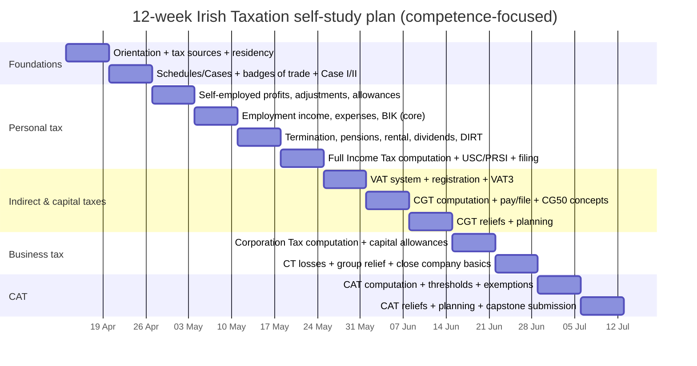

# Free 12‑Week Irish Taxation Self‑Study Course Design

## Executive summary

A free, practical 12‑week self‑study course can be created to **mirror the topic coverage and sequencing** of the UCD Professional Academy Diploma in Irish Taxation, while **avoiding any copying of proprietary teaching text** by building the curriculum around **Irish primary/official sources** (notably Revenue guidance, Citizens Information explanations, and the underlying legislation). The UCD course publicly lists 12 weekly modules spanning Income Tax (including USC/PRSI), VAT, CGT, Corporation Tax, and CAT—plus administration, research, and planning topics—making it feasible to mirror the scope at a learner‑competence level, but without offering a formal credential. citeturn5view0turn5view1

Crucially, much of the official Irish tax guidance you would link to (and, where appropriate, quote sparingly) is re‑usable under Ireland’s Public Sector Information (PSI) approach: Revenue explicitly encourages re‑use and specifies a CC BY 4.0‑aligned licence/attribution requirement for content on its website (with exclusions such as names/crests/logos). entity["organization","Office of the Revenue Commissioners","ireland tax authority"] citeturn20search0turn20search4 The Citizens Information website similarly states its information may be reproduced/re‑used free of charge subject to the PSI licence terms. entity["organization","Citizens Information Board","ireland public body"] citeturn20search1

This report provides a ready‑to‑build **open course blueprint**: week‑by‑week modules, objectives, primary reading lists (Revenue.ie, CitizensInformation.ie, legislation), weekly exercises and quizzes with sample answers, worked computations (Income Tax+USC/PRSI, VAT3, CGT, CT, CAT), an assessment rubric, capstone marking scheme, time estimates, and accessibility/formatting guidance for slides, cheat‑sheets, and spreadsheets.

## Reference syllabus and comparison with the UCD diploma

The UCD Professional Academy course page publicly describes the programme as a **12‑week** diploma covering all the major tax heads, and lists module titles from “Introduction to Irish Taxation” through VAT, CGT computation/reliefs, Corporation Tax computation/losses, and CAT exemptions/planning. citeturn5view0turn5view1 The brochure specifies part‑time study as **one 3‑hour live online evening class per week over 12 weeks**, and assessment as MCQ quizzes (20%) plus a **3,000‑word written assignment (80%)**, with an electronic diploma issued on completion. citeturn5view1 The course is marketed as updated for the latest Finance Act and “2026 tax regulations” (including Budget 2026 measures). citeturn5view0turn5view1turn12search7

A free self‑study course can mirror this **topic map + sequencing**, but should be explicit that it is **not a formal qualification** and does not include live instruction, tutor feedback, or an institution‑issued credential.

| Dimension | Free 12‑week self‑study course (this design) | UCD Professional Academy Diploma (public info) |
|---|---|---|
| Content coverage | Mirrors the 12 module topics (Income Tax incl. USC/PRSI; VAT; CGT; CT; CAT; administration/research/planning), using official sources, original explanations, and learner‑built templates. | 12 modules publicly listed with the same headings and subtopics. citeturn5view0turn5view1 |
| Duration & pacing | 12 weeks; suggested 5–8 hours/week self‑paced (reading + spreadsheet practice + quizzes). | 12 weeks; part‑time format stated as 1×3‑hour weekly live evening class. citeturn5view1 |
| Cost | Free (optional paid textbooks/tools). | Paid (promotions/partner pricing vary; UCD pages emphasise discounts but do not show a static fee in the accessible page text; one partner listing shows €890). citeturn5view0turn8search10 |
| Credential | None (optional open badge if you self‑issue under clear rules). | “UCD Professional Academy Diploma” issued electronically. citeturn5view1 |
| Assessment | Self‑marked weekly quizzes; a marked‑by‑rubric capstone (peer/self); optional “audit trail” portfolio. | Quizzes (20%) + 3,000‑word assignment (80%), two quiz attempts. citeturn5view1 |
| Evidence of learning | Portfolio of computations, VAT3/CT1/IT38 mock outputs, and a research log of sources used. | Institutional assessment + diploma artefact. citeturn5view1 |
| Pros | Zero cost; strongly practical; encourages primary‑source literacy; reusable templates; can be updated annually. | Guided by an instructor; structured cohort; credential; access to library resources mentioned. citeturn5view0turn5view1 |
| Cons | No formal recognition; no tutor feedback; higher risk of misunderstanding edge‑cases; requires self‑discipline and careful source checking. | Paid; scheduled attendance required; content access controlled; proprietary learning materials. citeturn5view0turn5view1 |

**Legal/ethical boundary for “mirroring without copying.”**  
Mirroring a syllabus is generally about **topics and learning outcomes**, not reproducing teaching notes. A safe approach is: (a) write your own explanations; (b) link to official pages; (c) use your own numbers and scenarios for exercises; (d) keep quotes short; and (e) use PSI licence attribution where you re‑use public sector information. Revenue explicitly permits free re‑use (copy/modify/publish/translate/adapt/distribute) subject to PSI/CC BY attribution and other conditions (including not using Revenue logos/symbols). citeturn20search0turn20search4

**Primary law sources.**  
For legislation references, the enacted Acts are available via the Irish Statute Book (e.g., Taxes Consolidation Act 1997; VAT Consolidation Act 2010; CAT Consolidation Act 2003). citeturn4search0turn4search1turn4search2 Revenue also notes that Irish Statute Book versions may not include later Finance Act amendments, and provides Notes for Guidance updated through Finance Act 2025. citeturn4search8turn4search28

entity["organization","Law Reform Commission","ireland statutory body"] The Law Reform Commission’s “Revised Acts” service is another way to read administratively consolidated legislation (useful for navigation), but you should still treat the underlying law as the source of truth. citeturn4search13

## Curriculum blueprint for a free 12‑week self‑study course

### Visual aid: 12‑week timeline (Mermaid)



### How to use this plan

This plan assumes **basic numeracy and no prior tax training**. The weekly pattern is deliberately repetitive to build competence:

1) Read official guidance → 2) Extract the rule into a 1‑page cheat‑sheet → 3) Apply it in a spreadsheet computation → 4) Self‑quiz → 5) Record your sources (link + date + “what changed my understanding”).

Where the course references “Revenue manuals,” it primarily means Revenue Tax and Duty Manuals and Notes for Guidance, which are designed to help explain operation of tax law (while commonly stating they are guidance and not definitive legal interpretation). citeturn4search28turn24search3

### Weekly modules, objectives, readings, practice, quizzes, and hours

**Week 1 — Tax system map, sources, and residency (5–7 hours)**  
Learning objectives: You will be able to (i) name the main Irish tax heads and where they sit in law vs guidance; (ii) determine Irish tax residence using day‑count tests; (iii) explain resident/ordinary resident/domicile at a high level and why it affects chargeability. citeturn15search1turn15search0turn15search3turn15search5turn15search6  
Core readings (priority order):  
- Revenue: “How to know if you are resident for tax purposes” (183/280 day tests, 30‑day minimum rule). citeturn15search1  
- Revenue: “Tax residence” overview (chargeability concepts; links to domicile/remittance). citeturn15search3turn15search5  
- Citizens Information: “Tax residence and domicile in Ireland” (plain‑English cross‑check). citeturn15search6  
- Legislation anchors: Taxes Consolidation Act 1997 (Part 34 residence provisions as the underlying legal framework). citeturn4search0turn15search7  
Practical exercise: Create a one‑page “Tax sources map” (Law → Finance Acts → Revenue Notes for Guidance → Tax and Duty Manuals → eBriefs → forms). Include one example link for each tier. citeturn4search28turn13search13turn18search12  
Quiz (sample questions + answers):  
- Q1: What day‑count makes you Irish tax resident in a tax year under the “current year” test? **A:** Presence for **183 days or more**. citeturn15search1  
- Q2: When do you become ordinarily resident? **A:** After being tax resident for **three consecutive tax years**, you are ordinarily resident from the **start of the fourth**. citeturn15search0  
- Q3: If you are tax resident but not domiciled, what basis may apply to foreign income? **A:** The **remittance basis** (Irish tax on foreign income to the extent remitted). citeturn15search5turn15search2  

**Week 2 — Classifying income: schedules/cases and badges of trade (6–8 hours)**  
Learning objectives: You will be able to (i) distinguish employment income vs trading/professional income vs rental vs investment; (ii) explain “trade” and why “badges of trade” matter; (iii) map common incomes to Schedule D Cases (competence level). citeturn24search12turn12search6  
Core readings:  
- Revenue manual: “General guidance on the classification of activities as trading” (trade concept; CT/trading linkage). citeturn24search12  
- Revenue UCD‑aligned subtopic support: Rental (Case V) rules intro (section 97 TCA context). citeturn12search6  
- Revenue: Dividend income overview (how it’s treated for individuals; links to filing thresholds). citeturn16search1  
- Legislation anchors: Taxes Consolidation Act 1997 (definitions and charging structure). citeturn4search0  
Practical exercise: Build a “classification table” with 15 example receipts (wages, tips, self‑employed fees, rent, dividends, bank interest, BIK, redundancy lump sum, etc.) and label each as Employment/Trade/Rental/Investment/Capital. For each, paste one supporting link (Revenue or Citizens Information). citeturn16search1turn12search3turn12search5  
Quiz:  
- Q1: What does Revenue cite as the general CT rate for trading income? **A:** **12.5%** applies to trading income; **25%** applies to certain non‑trading/excepted trade income. citeturn24search2  
- Q2: True/False: Rental profits are calculated property‑by‑property under Case V concepts. **A:** **True** (separate computation per property is a standard approach reflected in guidance). citeturn12search6  
- Q3: When might dividend income require self‑assessment registration? **A:** Guidance notes that above certain non‑PAYE thresholds you may need to register and file Form 11. citeturn16search1turn18search12  

**Week 3 — Self‑employed profits: tax‑adjusted profit, revenue vs capital, capital allowances (6–8 hours)**  
Learning objectives: You will be able to (i) reconcile accounting profit to taxable profit (add‑backs/deductions); (ii) distinguish revenue vs capital expenditure at a practical level; (iii) compute a basic capital allowance claim for plant & machinery. citeturn24search15turn1search8  
Core readings:  
- Revenue: “A guide to self‑assessment / Pay and File” (overall compliance workflow). citeturn18search10turn18search15  
- Revenue: Capital allowances and deductions (rates for plant & machinery; industrial buildings; ACA concept). citeturn24search15  
- Revenue tax forms hub: Form 11 / guides listing (identify what you’d eventually file). citeturn18search12  
- Legislation anchors: Taxes Consolidation Act 1997 (capital allowances framework sits here; use Notes for Guidance for navigation). citeturn4search0turn4search28  
Practical exercise: Use a simple P&L (provided by you) and produce a tax‑adjusted profit schedule in a spreadsheet with (a) depreciation add‑back, (b) entertainment disallowance, (c) capital allowances deduction. (Keep it competence‑level: one asset pool.) citeturn24search15  
Quiz:  
- Q1: What capital allowance rate is stated for plant and machinery for companies? **A:** **12.5% over eight years**. citeturn24search15  
- Q2: True/False: Capital allowances generally replace depreciation for tax purposes (i.e., you add back depreciation then claim allowances). **A:** **True** as a standard tax adjustment pattern in computations. citeturn24search15  
- Q3: What is the Pay and File date highlighted for self‑assessment in guidance (general rule)? **A:** **31 October** is the common Pay and File date in self‑assessment guidance (subject to ROS extensions in practice). citeturn18search10turn18search15  

**Week 4 — Employment income, expenses, and Benefit‑in‑Kind basics (5–7 hours)**  
Learning objectives: You will be able to (i) explain PAYE at a high level; (ii) identify common employee expense relief mechanisms (e.g., flat rate expenses); (iii) compute a basic BIK cash equivalent for an employer‑provided car scenario using Revenue examples. citeturn24search16turn16search3turn12search10turn12search1  
Core readings:  
- Revenue PAYE guide (system overview). citeturn24search16  
- Revenue: Flat Rate Expenses (FRE) overview (what they are; examples). citeturn16search3  
- Revenue: Employer‑provided cars BIK overview + “How to calculate the taxable benefit” (worked example style). citeturn12search10turn12search1  
- Revenue: BIK exemptions/reductions page (electric vehicle notes; links to manuals). citeturn12search4turn12search22  
Practical exercise: Create a payslip‑style breakdown template with rows for Gross pay, Tax, USC, PRSI, Net pay, plus a box for “non‑cash benefits (BIK) – taxable notional pay.” Use one Revenue BIK example and replicate the calculations in your own spreadsheet. citeturn12search1turn12search10  
Quiz:  
- Q1: What is PAYE in Revenue’s description? **A:** A method where the employer calculates and deducts Income Tax each time wages/salary are paid. citeturn24search16  
- Q2: Give two examples of expenses commonly covered by FRE. **A:** Tools, uniforms, statutory registration fees (examples listed in guidance). citeturn16search3  
- Q3: True/False: Travel to/from work is generally treated as private use in company car BIK context. **A:** **True**. citeturn12search10  

**Week 5 — Termination payments, pensions, rental income, dividends and DIRT (6–8 hours)**  
Learning objectives: You will be able to (i) explain the basic treatment of termination lump sums and where exemptions/reliefs may apply; (ii) compute taxable rental profit; (iii) explain DIRT and dividend treatment at a high level; (iv) locate pension relief limits. citeturn12search5turn12search3turn16search0turn16search1turn16search2  
Core readings:  
- Revenue: Lump sum payments overview + basic exemption and SCSB pages. citeturn12search5turn12search26turn12search2  
- Revenue: Rental profit and losses + “How do you calculate your taxable income?” citeturn12search3turn12search9  
- Revenue: DIRT rate page. citeturn16search0  
- Revenue: Dividend income overview. citeturn16search1  
- Revenue: Pension contribution relief limits and pension relief overview. citeturn16search6turn16search2  
Practical exercise:  
1) Construct a rental computation: Gross rent minus allowable expenses = net rental income (profit/loss). citeturn12search3turn12search9  
2) Add that net rental income to a simplified personal income tax computation worksheet to show that it increases taxable income and can push income into higher rate. citeturn24search8turn24search0  
Quiz:  
- Q1: What is the stated DIRT rate deducted from deposit interest for Irish‑resident individuals (as per Revenue page)? **A:** **33%**. citeturn16search0  
- Q2: True/False: You pay tax on net rental income (gross rent less allowable expenses). **A:** **True**. citeturn12search3turn12search9  
- Q3: According to Revenue guidance, what determines the maximum pension contribution amount that qualifies for relief (high level)? **A:** Age‑related percentage limits and earnings limits (illustrated in the limits guidance). citeturn16search2  

**Week 6 — Full Income Tax computation, USC/PRSI, and filing workflow (6–9 hours)**  
Learning objectives: You will be able to (i) compute Income Tax using 2026 bands and credits; (ii) compute USC using 2026 thresholds/rates; (iii) explain PRSI at a practical payroll level; (iv) understand Pay and File concepts and which forms apply (Form 11/Form 12/CG1). citeturn24search0turn0search8turn3search4turn18search12turn18search20  
Core readings:  
- Revenue: Tax rates, bands and reliefs (2026 rate band and key credits). citeturn24search0  
- Revenue: “How your Income Tax is calculated” (worked examples; method). citeturn24search8  
- Revenue: USC page for 2026 rates/thresholds (table). citeturn0search8  
- entity["organization","Department of Social Protection","ireland central govt"] Gov.ie PRSI Class A contribution rates (includes the October 2026 increase). citeturn3search4  
- Revenue: Tax return forms hub; Pay and File guide. citeturn18search12turn15search25  
Practical exercise: Build a “single person PAYE” annual computation sheet (Income Tax + USC + PRSI estimate) and reconcile it to a monthly version (divide and sense‑check—acknowledging payroll operates per pay period). citeturn24search0turn0search8turn3search4  
Quiz:  
- Q1: What is the 2026 standard rate band for a single person per Revenue’s chart? **A:** **€44,000 @ 20%**, balance @ **40%**. citeturn24search0  
- Q2: What is the USC entry threshold mentioned in Notes for Guidance (high level)? **A:** USC applies when chargeable income exceeds **€13,000** (subject to detailed rules). citeturn24search5  
- Q3: From what date does the gov.ie page show an employee PRSI Class A rate of 4.35%? **A:** **From 1 October 2026**. citeturn3search4  

**Week 7 — VAT foundations: registration, rates, net vs gross, VAT3 mechanics (6–9 hours)**  
Learning objectives: You will be able to (i) explain VAT as a tax on supplies with input credit mechanics; (ii) determine when registration is required using threshold guidance; (iii) compute VAT on net/gross invoices; (iv) complete a simplified VAT3 (T1–T4) from a sales/purchase ledger. citeturn12search0turn0search13turn17view0turn19search1  
Core readings:  
- Revenue: VAT thresholds (goods/services thresholds). citeturn12search0  
- Revenue: Current VAT rates (standard/reduced/second reduced/zero). citeturn0search13  
- Revenue: VAT3 completion guide (T1–T4 definitions; E‑fields). citeturn17view0  
- Revenue: When VAT becomes payable + filing deadline rule (19th / ROS 23rd). citeturn19search1turn19search2  
Practical exercise: Create a VAT workbook with three tabs: Sales invoices, Purchase invoices, VAT3 summary. Map totals into T1/T2 and compute T3/T4. citeturn17view0turn19search1  
Quiz:  
- Q1: What does VAT3 “T1” represent in Revenue’s VAT3 guidance? **A:** Total VAT due on sales (and certain acquisitions/imports/services per the guidance). citeturn17view0  
- Q2: What must you do if T2 exceeds T1? **A:** VAT is repayable; the difference is shown at **T4**. citeturn17view0  
- Q3: What filing/payment date does Revenue state for VAT returns (general rule)? **A:** By the **19th** of the following month (extended to the **23rd** for ROS filers). citeturn19search1turn19search2  

**Week 8 — CGT computation: chargeable gain, exemption, losses, pay & file (6–8 hours)**  
Learning objectives: You will be able to (i) compute a chargeable gain; (ii) apply the annual personal exemption; (iii) understand the two CGT payment windows (15 Dec / 31 Jan) and filing deadline (31 Oct following year); (iv) recognise when CG50A clearance is relevant at a concept level. citeturn24search20turn22search27turn18search0turn18search3turn18search14  
Core readings:  
- Revenue: CGT “How to calculate CGT” (method + examples). citeturn18search17turn24search20  
- Revenue: “What is exempt from CGT?” (personal exemption €1,270). citeturn22search27  
- Revenue: “When and how do you pay and file CGT?” (dates). citeturn18search0  
- Revenue: CG50A clearance certificate page + eCG50 guidance (withholding concept). citeturn18search3turn18search5turn18search14  
Practical exercise: Produce a CGT computation sheet for two disposals and one loss; apply losses and then the €1,270 exemption; compute tax at 33% (most gains). citeturn24search20turn22search27  
Quiz:  
- Q1: What is the main CGT rate for most gains? **A:** **33%**. citeturn24search20  
- Q2: What is the annual personal exemption for individuals? **A:** **€1,270** (after losses). citeturn22search27  
- Q3: Payment date: If you dispose of an asset on 10 July, when is CGT due (general rule)? **A:** By **15 December** of the same year (for disposals 1 Jan–30 Nov). citeturn18search0  

**Week 9 — CGT reliefs and planning (competence level) (5–7 hours)**  
Learning objectives: You will be able to (i) identify the main CGT relief categories (e.g., PPR, entrepreneur/retirement relief concepts—without deep exam‑style detail); (ii) understand that CGT and CAT can both arise on the same event and a credit mechanism may apply; (iii) add “relief‑eligibility checklist” thinking to your computations. citeturn14search3turn14search10  
Core readings:  
- Revenue: Credit for CGT against CAT (overview). citeturn14search3  
- Revenue CAT manual: allowance/credit for CGT on same event (technical guidance). citeturn14search10turn14search7  
- Revenue: CGT payment/filling rules (keep compliance in view). citeturn18search0  
Practical exercise: Create a two‑page checklist: (1) “Is there a disposal?” (2) “What costs are allowable?” (3) “Any losses?” (4) “Any exemption/relief?” (5) “When do I pay/file?” Apply it to three scenarios (shares, property gift, chattel). citeturn18search0turn18search17turn22search27  
Quiz:  
- Q1: Can CGT and CAT apply to the same property/event? **A:** Yes; Revenue notes you may be entitled to a CGT credit against CAT in specified circumstances. citeturn14search3turn14search7  
- Q2: True/False: The CGT credit can exceed the CAT attributable to the doubly‑taxed property. **A:** **False** (guidance describes limits on the credit). citeturn14search7turn14search10  
- Q3: If no CGT is payable due to reliefs/losses, do you still file? **A:** Yes; the filing obligation still applies. citeturn18search0turn18search16  

**Week 10 — Corporation Tax computation: residence concept, rates, capital allowances, CT1 timing (6–9 hours)**  
Learning objectives: You will be able to (i) compute a basic CT liability from adjusted trading profit; (ii) apply the main CT rates (12.5% trading; 25% non‑trading); (iii) understand CT filing/payment deadlines at a high level and where CT1 sits. citeturn24search2turn24search15turn19search0turn19search3  
Core readings:  
- Revenue: CT basis of charge (rates and scope). citeturn24search2  
- Revenue: Capital allowances and deductions (company perspective). citeturn24search15  
- Revenue: CT payment and filing page (nine months; 23rd of ninth month for e‑filers). citeturn19search0  
- Revenue manual: CT1 filing timing details (9 months / 23rd day mechanics). citeturn19search3  
Practical exercise: Build a “CT computation bridge” spreadsheet tab: accounting profit → add‑backs → deduct allowances → taxable profit → CT at appropriate rate. Then add a calendar reminder block keyed off accounting period end. citeturn19search0turn24search2  
Quiz:  
- Q1: What are the two headline CT rates in Revenue’s basis‑of‑charge page? **A:** **12.5% trading**; **25%** for certain non‑trading/excepted trade income. citeturn24search2  
- Q2: What is the stated general e‑filing CT deadline pattern? **A:** File/pay **nine months** after AP end; payment by the **23rd of the ninth month** for electronic filers. citeturn19search0turn19search3  
- Q3: True/False: An accounting period can be longer than 12 months for CT charging. **A:** **False** (CT is charged on profits in an accounting period that cannot be longer than 12 months). citeturn24search2  

**Week 11 — CT losses, group relief, and close company concepts (competence level) (6–8 hours)**  
Learning objectives: You will be able to (i) explain trading losses and basic carry‑back/carry‑forward ideas; (ii) understand the purpose and claim timing for group relief; (iii) explain close‑company surcharge rationale at a high level. citeturn13search7turn13search0turn13search5  
Core readings:  
- Revenue: Trading losses page (offset options; euro‑for‑euro concept). citeturn13search7  
- Revenue: Group Relief page (claim timing; late filing restrictions concept). citeturn13search0turn13search4  
- Revenue: Close company surcharge page (20% surcharge on certain undistributed income; high level). citeturn13search5turn13search12  
Practical exercise: Create three mini‑cases: (1) single company loss carry‑back to prior AP; (2) group relief surrender/claim mapping; (3) distribution policy scenario to see how surcharge might arise conceptually. Use a “rule + citation” note for each. citeturn13search7turn13search0turn13search5  
Quiz:  
- Q1: What does Revenue state about trading loss relief timing at a high level? **A:** Losses can be offset against other trading income in the same AP or the immediately preceding AP (with claims and rules). citeturn13search7  
- Q2: What is the stated time limit to claim group relief (per Revenue page)? **A:** Within **two years** from the end of the surrendering company’s accounting period (per the page). citeturn13search0  
- Q3: What surcharge rate is stated for undistributed after‑tax estate/investment income of close companies? **A:** **20%** (with reduction mechanics if distributed within 18 months). citeturn13search5turn13search1  

**Week 12 — CAT computation, exemptions/reliefs, filing dates, and capstone (7–10 hours)**  
Learning objectives: You will be able to (i) compute CAT using thresholds and 33% rate; (ii) apply the small gift exemption, spouse exemption, and recognise major reliefs (dwelling house exemption; agricultural/business relief) at a competence level; (iii) understand CAT filing/payment timing rules; (iv) complete a capstone portfolio. citeturn21view0turn22search0turn22search1turn14search0turn14search1turn14search2turn18search21  
Core readings:  
- Revenue: CAT group thresholds (current Group A/B/C values and worked examples). citeturn21view0  
- Revenue: CAT overview page (33% rate statement) + small gift exemption + spouse/civil partner exemption. citeturn22search25turn22search0turn22search1  
- Revenue: Dwelling house exemption overview + qualifying conditions. citeturn14search0turn14search8  
- Revenue: Agricultural relief + business relief overview (90% reduction subject to conditions). citeturn14search1turn14search2  
- Revenue: CAT pay and file dates (valuation‑date windows). citeturn18search21  
Practical exercise: Compute CAT for (a) inheritance from parent to child exceeding threshold; (b) multiple gifts from different people applying €3,000 small gift exemption per disponer; (c) agricultural relief scenario (competence‑level: apply 90% reduction and note conditions checklist). citeturn21view0turn22search0turn14search1turn14search16  
Quiz:  
- Q1: What are the current CAT group thresholds shown for benefits on/after 2 October 2024? **A:** Group A **€400,000**, Group B **€40,000**, Group C **€20,000**. citeturn21view0  
- Q2: What is the annual “small gift exemption” amount per disponer? **A:** **€3,000** per person per calendar year (gifts). citeturn22search0turn22search8  
- Q3: What reduction rate is stated for agricultural relief/business relief (high level)? **A:** A **90% reduction** in taxable value (subject to conditions). citeturn14search1turn14search2  

## Worked computations and tax computation workflow

### Visual aid: Flowchart of personal tax computation steps (Mermaid)

```mermaid
flowchart TD
    A[Start: Identify taxpayer + tax year] --> B[Check residence / ordinary residence / domicile]
    B --> C[Gather income sources]
    C --> D[Classify income: employment / trade / rental / investment / capital]
    D --> E[Compute taxable amounts per category]
    E --> F[Sum taxable income]
    F --> G[Apply Income Tax bands: 20% then 40%]
    G --> H[Subtract tax credits (e.g., personal + employee credits)]
    H --> I[Compute USC on chargeable income]
    I --> J[Compute PRSI based on class + pay period rules]
    J --> K[Add other liabilities (e.g., CGT due dates separate; CAT if applicable)]
    K --> L[Check filing/payment obligations + deadlines]
    L --> M[End: Document calculation + sources + assumptions]
```

### Worked example set

The examples below are deliberately **educational**: they focus on the computation mechanics and source‑checking. They are not a substitute for professional advice for complex cases.

#### Worked computation: Income Tax + USC + PRSI for a PAYE employee (2026)

Scenario (simplified): Single PAYE employee with **gross annual pay €52,000**, no other income, claims standard personal and employee credits only.

**Step 1 — Income Tax using 2026 band and credits**  
- Standard rate band (single): **€44,000 @ 20%**, balance @ **40%**. citeturn24search0  
- Tax credits (2026): Single Person credit **€2,000**; Employee credit **€2,000**. citeturn24search0  

Computation:  
- €44,000 × 20% = €8,800  
- Remaining €8,000 × 40% = €3,200  
- Gross Income Tax = €12,000  
- Less credits €4,000 ⇒ **Income Tax payable = €8,000** citeturn24search0turn24search8  

**Step 2 — USC using 2026 USC rate table**  
Use the 2026 USC thresholds/rates table (standard rates shown on Revenue’s USC chart page). citeturn0search8  
Compute USC progressively (rounded to cents):  
- First €12,012 @ 0.5% = €60.06  
- Next €16,688 @ 2% = €333.76  
- Remaining €52,000 − €28,700 = €23,300 @ 3% = €699.00  
Total **USC = €1,092.82** citeturn0search8  

**Step 3 — PRSI (Class A illustration; rate change within 2026)**  
PRSI rates depend on class and pay period; Class A employee rate increases from **4.2% to 4.35% from 1 October 2026** (per the gov.ie PRSI table). citeturn3search4  
A simple annualised estimate for a steady salary is:  
- Jan–Sep (9/12) at 4.2% and Oct–Dec (3/12) at 4.35% ⇒ blended rate 4.2375%  
- €52,000 × 0.042375 ≈ **€2,203.50 PRSI** (approximate; payroll applies per pay period). citeturn3search4  

**Output summary (illustrative):**  
Income Tax €8,000 + USC €1,092.82 + PRSI ~€2,203.50 ⇒ total deductions ~€11,296.32, before any other credits/reliefs. Rates/bands/credits must be checked for the specific year and circumstances. citeturn24search0turn0search8turn3search4  

#### Worked computation: VAT3 (T1–T4) from a simple ledger

Scenario: A VAT‑registered business in a bi‑monthly taxable period has:  
- Sales (all standard‑rated 23% for simplicity): net €100,000  
- Purchases with deductible VAT (standard‑rated 23%): net €50,000  

**Step 1 — Compute output VAT (T1 component)**  
Output VAT = €100,000 × 23% = €23,000 (VAT rate reference). citeturn0search13  

**Step 2 — Compute input VAT (T2 component)**  
Input VAT = €50,000 × 23% = €11,500 (assumes fully deductible and linked to taxable supplies). citeturn17view0turn0search13  

**Step 3 — Map to VAT3 fields**  
Revenue’s VAT3 guidance defines:  
- T1 = VAT on sales (and certain acquisitions/imports/services depending on circumstances)  
- T2 = VAT on purchases you are entitled to reclaim  
- T3 = payable if T1 > T2 (difference)  
- T4 = repayable if T2 > T1 (difference) citeturn17view0  

So:  
- T1 = €23,000  
- T2 = €11,500  
- T3 = €11,500 payable  
- T4 = €0  

**Step 4 — Timing check (compliance habit)**  
Revenue states VAT is filed/paid by the **19th** of the following month, extended to the **23rd** for ROS filers. citeturn19search1turn19search2  

#### Worked computation: CGT on sale of shares (basic)

Scenario: Individual sells shares for €8,000, cost €5,000, no other gains/losses.

- Gain = €3,000  
- Less annual personal exemption €1,270 ⇒ taxable gain €1,730 citeturn22search27  
- CGT rate for most gains 33% ⇒ €1,730 × 33% = **€570.90 CGT** citeturn24search20turn18search27  

Payment/filling habit: disposals in 1 Jan–30 Nov paid by 15 Dec same year; disposal return filed by 31 Oct following year. citeturn18search0  

#### Worked computation: Corporation Tax on trading profits (basic bridging)

Scenario: Irish resident company with accounting profit before tax €150,000. Adjustments: depreciation €10,000 (add back), entertaining €2,000 (add back). Capital allowances on plant & machinery: asset pool €40,000; claim one year of writing‑down allowance at 12.5% = €5,000. (Competence‑level illustration.)

- Accounting profit €150,000  
- Add backs: €10,000 + €2,000 = €12,000 ⇒ subtotal €162,000  
- Less capital allowances €5,000 ⇒ taxable trading profit €157,000 citeturn24search15  
- CT rate on trading income: **12.5%** ⇒ €157,000 × 12.5% = **€19,625 CT** citeturn24search2turn24search6  

Timing habit: Revenue indicates CT return filed and tax paid around nine months after AP end (with the 23rd‑day rule for e‑filers). citeturn19search0turn19search3  

#### Worked computation: CAT on inheritance from parent to adult child (basic)

Scenario: Adult child inherits €500,000 from a parent; no prior benefits in Group A.

- Group A threshold (on/after 2 Oct 2024): €400,000 citeturn21view0  
- Taxable excess: €500,000 − €400,000 = €100,000  
- CAT rate: 33% citeturn22search25  
- CAT due: €100,000 × 33% = **€33,000**  

Filing/payment habit: Revenue describes payment timing based on valuation date falling in Jan–Aug vs Sep–Dec windows. citeturn18search21  

## Assessment design, rubrics, and capstone marking scheme

### Weekly assessment pattern

This replicates the “small quiz + major assignment” spirit of the UCD diploma assessment model (without copying it), while adapting it to self‑study:

- Weekly quiz (10–15 minutes): 6–10 questions, self‑marked with answer key.
- Weekly practical task (60–120 minutes): one spreadsheet computation or compliance workflow exercise.
- Weekly reflection (10 minutes): “What source did I trust most and why?” + “What assumption did I make?”

UCD publicly states quizzes are used throughout the course and a final written assignment is the major component. citeturn5view1

### Rubric for weekly practical tasks (self‑mark / peer‑mark)

Each weekly task is marked out of **20**:

- **Technical accuracy (8):** computations correct; correct rate/threshold used for the relevant year; arithmetic traceable.  
- **Source discipline (5):** links to the exact official page/manual section used; notes what the source says; identifies date/version.  
- **Working clarity (4):** spreadsheet is readable; assumptions clearly stated; outputs labelled.  
- **Reflection and corrections (3):** identifies at least one error or uncertainty and how it was resolved.

### Capstone project options (choose one, or do both)

**Capstone A — Personal tax portfolio (recommended for most learners)**  
Deliverables (target 10–15 pages plus spreadsheets):  
1) A full Income Tax computation for one individual with at least three income sources (e.g., employment + rental + dividends), including USC and PRSI estimate, using 2026 rates and credits. citeturn24search0turn0search8turn3search4turn12search3turn16search1  
2) A “Pay & File map” stating which forms would be relevant (Form 11 vs Form 12 vs CG1), with deadlines and why. citeturn18search12turn18search20turn18search0  
3) A one‑page tax research log showing at least 12 primary sources (Revenue pages/manuals/Notes for Guidance + one legislation link per major topic). citeturn4search28turn4search0turn4search1turn4search2  

**Capstone B — Micro‑business compliance pack (VAT + CT + owner extraction concept)**  
Deliverables:  
1) A VAT workbook (sales/purchases) that produces VAT3 T1–T4 and a narrative explaining T1/T2 mapping. citeturn17view0turn19search1  
2) A CT computation bridge (accounting profit to taxable profit), with capital allowance schedule and filing/payment dates keyed off year‑end. citeturn24search15turn19search0  
3) A short memo (800–1,200 words) describing compliance risks: late filing restrictions for reliefs, and how you would avoid them in practice. citeturn13search4turn19search9  

### Capstone marking scheme (100 points)

- **Correct computations (40):**  
  - Income Tax + credits + USC + PRSI logic (15) citeturn24search0turn0search8turn3search4  
  - VAT3 correctness, T1–T4 mapping (10) citeturn17view0  
  - CGT/CAT computations and dates (10) citeturn18search0turn21view0turn22search25  
  - CT computation and rate selection (5) citeturn24search2  
- **Source accuracy & citation quality (25):** quality and primacy of sources; correct year; correct page. citeturn4search28turn20search0  
- **Spreadsheet engineering (15):** auditability, structure, error checks, clear labels.  
- **Communication (10):** plain English explanations; assumptions; limitations.  
- **Professionalism (10):** tidy presentation; consistent rounding; version/date noted; no confidential/personal data.

## Resources, tooling, and open‑licence production notes

### Priority resource stack (official-first)

**Core guidance portals**  
- Revenue guidance pages for individuals, VAT, CGT, CT, CAT, and the Tax and Duty Manuals. (Example: VAT3 and VAT due dates; CGT pay/file; CT pay/file.) citeturn17view0turn19search1turn18search0turn19search0  
- Citizens Information for learner‑friendly explanations and examples (e.g., how income tax is calculated; credits/reliefs). citeturn23search9turn23search15  
- Irish Statute Book for enacted legislation (TCA 1997; VATCA 2010; CATCA 2003). citeturn4search0turn4search1turn4search2  

**Key forms and “real world artefacts”**  
- Revenue tax return forms hub (Form 11, Form 12, CG1) to familiarise yourself with layout and terminology. citeturn18search12  
- VAT3 field definitions (T1–T4, E‑fields) from Revenue guidance. citeturn17view0  

**Cross‑jurisdiction comparator (optional, for learning only)**  
entity["organization","HM Revenue & Customs","uk tax authority"] Use HMRC self‑assessment guidance/forms only as a conceptual comparator (how another system structures returns), not as a source for Irish rules.

### Accessibility and formatting suggestions (slides, cheat‑sheets, spreadsheets)

Because the course is computation‑heavy, accessibility is best achieved through **consistent, low‑cognitive‑load artefacts**:

- **One slide deck per week (8–12 slides):**  
  - Slide 1: “What you can do after this week” (3 outcomes)  
  - Slides 2–4: concept map + definitions  
  - Slides 5–8: worked example (with numbers)  
  - Slide 9: common errors checklist  
  - Slide 10: reading list + links  

- **Cheat‑sheets (1 page each):**  
  - “Income Tax computation steps” (bands → credits → USC → PRSI) with a mini example. citeturn24search8turn0search8turn3search4  
  - “VAT3 mapping” (ledger → T1/T2 → T3/T4) keyed to Revenue field definitions. citeturn17view0  
  - “CGT timeline” (date of disposal → pay date → file date). citeturn18search0  
  - “CAT thresholds and exemptions snapshot” (Group thresholds; €3,000 small gift; spouse exemption). citeturn21view0turn22search0turn22search1  

- **Spreadsheet templates (recommended tabs):**  
  - Personal tax: Income sources; Income Tax; USC; PRSI estimate; Summary. citeturn24search0turn0search8turn3search4  
  - VAT: Sales ledger; Purchase ledger; VAT3 summary (T1–T4). citeturn17view0  
  - CGT: Disposals; Allowable costs; Losses; Exemption; Tax due; Pay/file dates. citeturn18search0turn22search27  
  - CT: Accounts profit; Add‑backs; Deductions; Capital allowances; Rate; CT due; deadlines. citeturn24search2turn19search0  
  - CAT: Benefits; Aggregation; Threshold; Exemptions/reliefs checklist; Tax due; pay/file dates. citeturn21view0turn18search21  

- **Accessibility specifics:**  
  - Use an accessible font, high contrast, and avoid colour‑only meaning.  
  - Provide alt text for charts/diagrams.  
  - Keep spreadsheets keyboard‑navigable; avoid merged cells; label all inputs clearly; provide a “Notes” section that states assumptions and cites sources.

### Licensing for open educational use

- Revenue states that information on its website is copyright of Revenue (unless otherwise indicated) and may be re‑used free of charge under a PSI licence conforming to **CC BY 4.0**, with a specific attribution statement required and exclusions (e.g., no right to use official symbols/logos). citeturn20search0turn20search4  
- Citizens Information states information and documents obtained from its site may be reproduced/re‑used free of charge subject to the PSI licence. citeturn20search1  
- The Irish Statute Book provides an Open Data initiative consistent with PSI/CC BY style licensing for re‑use of legislation data. citeturn20search10turn4search0  

**Practical implication for your course build:** You can publish your own course text under CC BY (or CC BY‑SA) while including (a) your own original explanations and examples, (b) links to official pages, and (c) PSI‑attributed re‑use where you copy small portions (still best to keep quotations short and use paraphrase + citations for clarity).

### Direct links (copy/paste)

```text
UCD Professional Academy – Irish Taxation course page:
https://www.ucd.ie/professionalacademy/findyourcourse/irish-taxation/

Revenue – Tax rates, bands and reliefs (2026):
https://www.revenue.ie/en/personal-tax-credits-reliefs-and-exemptions/tax-relief-charts/index.aspx

Revenue – USC (2026) rates/thresholds table:
https://www.revenue.ie/en/personal-tax-credits-reliefs-and-exemptions/tax-relief-charts/usc.aspx

Gov.ie – PRSI contribution rates:
https://www.gov.ie/en/publication/80e1a-prsi-contribution-rates/

Revenue – VAT thresholds:
https://www.revenue.ie/en/vat/vat-registration/who-should-register-for-vat/vat-thresholds.aspx

Revenue – VAT3 completion guide (T1–T4):
https://www.revenue.ie/en/vat/accounting-for-vat/how-to-account-for-value-added-tax/completing-vat3-return.aspx

Revenue – CGT pay & file dates:
https://www.revenue.ie/en/gains-gifts-and-inheritance/transfering-an-asset/when-and-how-do-you-pay-and-file-cgt.aspx

Revenue – CAT group thresholds (incl. €400k Group A from 2 Oct 2024):
https://www.revenue.ie/en/gains-gifts-and-inheritance/cat-thresholds-rates-and-aggregation-rules/cat-thresholds.aspx

Irish Statute Book – Taxes Consolidation Act 1997:
https://www.irishstatutebook.ie/eli/1997/act/39/enacted/en/html

Irish Statute Book – Value-Added Tax Consolidation Act 2010:
https://www.irishstatutebook.ie/eli/2010/act/31/enacted/en/html

Irish Statute Book – Capital Acquisitions Tax Consolidation Act 2003:
https://www.irishstatutebook.ie/eli/2003/act/1/enacted/en/html
```

entity["organization","University College Dublin","dublin, ireland"]